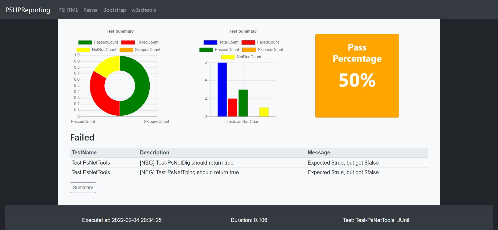

# Table of Contents

- [PSHPReporting](#pshpreporting)
- [Folder structure](#folder-structure)
- [Usage with JUnitXML](#usage-with-junitxml)
- [Usage with NUnitXML](#usage-with-nunitxml)
- [Web Server](#web-server)

# PSHPReporting

PSHPReporting - PowerShell PSHTML-based Pester Reporting



[Top](#table-of-contents)

## Requirements

PowerShell 7, PSHTML, Pode Server or IIS, Apache Tomcat, or other web-server.

## Folder structure

````
.\PSHPREPORTING
|   README.md
|   Test-PsNetTools_JUnitXml.html
|   Test-PsNetTools_NUnitXml.html
|   
+---assets
|   +---BootStrap
|   |       bootstrap.js
|   |       bootstrap.min.css
|   |       bootstrap.min.js
|   |
|   +---Chartjs
|   |       Chart.bundle.min.js
|   |       LICENSE.md
|   |
|   \---Jquery
|           jquery.min.js
|
+---bin
|       Invoke-PesterResult.Tests.ps1
|       New-PesterReport.ps1
|       Read-FromXML.ps1
|       
+---data
|       Test-PsNetTools.JUnitXml
|       Test-PsNetTools.NUnitXml
|
+---img
|       PSHPReporting.jpg
|
\---style
        style.css
````

## PSHPREPORTING

Root-folder, it contains the html-files.

### bin

Path to store the PowerShell-Scripts.

### data

Path to store the Inputfiles (JUnitXml, NUnitXml).

### img

Path to store Pictures/Images.

### style

Path to store CSS.

[Top](#table-of-contents)

## Usage with JUnitXML

````New-PesterReport.ps1```` use the JUnitXml file from a Pester Test. It ````ConvertFrom-PesterJUnitXml```` to a PSCustomObject and create a PSHTML-Page.

To create a JUnitXml run: 
````Invoke-Pester -Path .\ -OutputFile .\data\Test-PsNetTools.JUnitXml -OutputFormat JUnitXml````

To create a PSHTML-Page run: ````New-PesterReport.ps1````

[Top](#table-of-contents)

## Usage with NUnitXML

````New-PesterReport.ps1```` use the NUnitXml file from a Pester Test. It ````ConvertFrom-PesterNUnitXml```` to a PSCustomObject and create a PSHTML-Page.

To create a NUnitXml run: 
````Invoke-Pester -Path .\ -OutputFile .\data\Test-PsNetTools.NUnitXml -OutputFormat NUnitXml````

To create a PSHTML-Page run: ````New-PesterReport.ps1````

[Top](#table-of-contents)

## Web Server

Copy the root-folder to the web-folder and remove the folder bin and data.

[Top](#table-of-contents)
